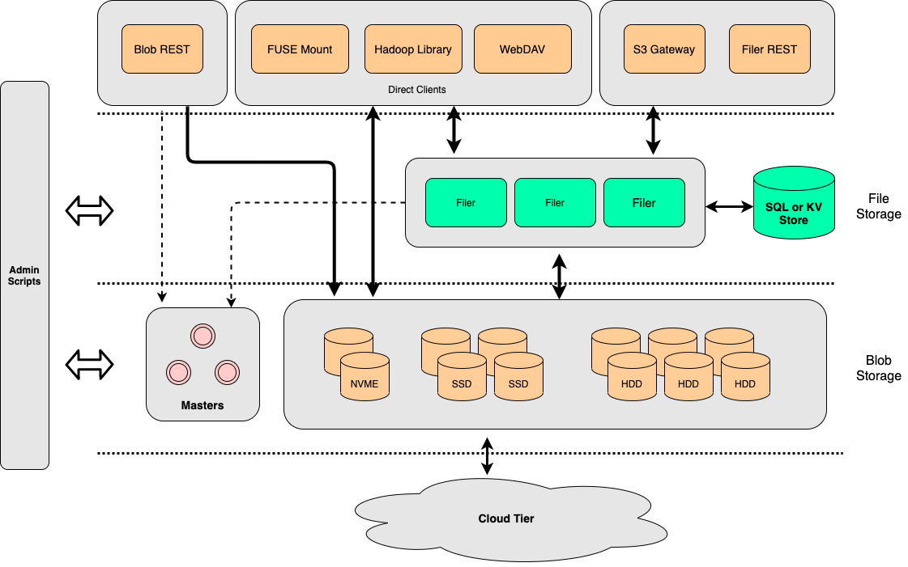
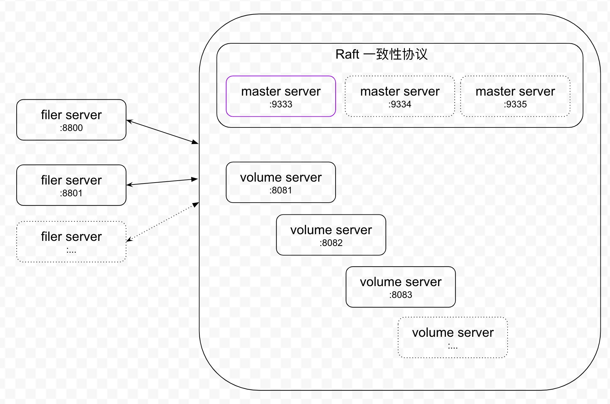

# 单机部署
## 架构图

## 部署图

## 部署步骤
### 规划部署机器磁盘大小、磁盘地址、服务端口

- 需要部署三类服务

|服务|个数|备注|
| ---| ---| ---|
|maser server|1|如：9333|
|volume server|1|如：9433|
|filer server|1|如：9533|

### 部署 seaweedfs 应用
#### 准备目录
> 为服务提供数据和日志存储

|用途|备注|
| ---| ---|
|data||
|log||

>示例
```shell 
mkdir -p data log
```

#### 准备应用程序
从 [seaweedfs 下载地址](https://github.com/chrislusf/seaweedfs/releases) 下载适合的版本

#### 部署 server
##### 注意事项
- `logdir` 是 `weed` 的参数，应该紧邻 `weed` 之后
- 如果在同一台机器部署多个进程，注意 `logdir` 区分开，不要放在一起，避免 `soft link` 覆盖
- 如果机器存在多网卡、多`IP`，需要指定 `ip` 参数，避免因 `ip` 识别错误而无法组成集群
- 为保证自身数据安全开启数据加密，参数 `-encryptVolumeData`
##### 准备 `MySQL`
`filer` 使用 `MySQL` 存储对象元数据信息，需要准备一个可以访问的数据库以及用户
- 数据库
- user
- 表 (不存在会自动创建)
> 示例
```sql
create database weed_cluster_0 character set utf8mb4;
create user 'weed_cluster_0' identified by 'weed_cluster_0';
grant all privileges on weed_cluster_0.* to weed_cluster_0;
 
CREATE TABLE IF NOT EXISTS weed_cluster_0.filemeta (
  dirhash     BIGINT         COMMENT 'first 64 bits of MD5 hash value of directory field',
  name        VARCHAR(1000)  COMMENT 'directory or file name',
  directory   TEXT           COMMENT 'full path to parent directory',
  meta        LONGBLOB,
  PRIMARY KEY (dirhash, name)
) DEFAULT CHARSET=utf8;
```
##### 准备 `filer server` 配置文件
|事项|说明|
|---|---|
|文件名|`filer.toml`|
|配置文件初始化方法|`weeb scaffold -config filer -output="."`|
|配置文件生效位置和顺序|The configuration file "filer.toml" is read from ".", "$HOME/.seaweedfs/", "/usr/local/etc/seaweedfs/", or "/etc/seaweedfs/", in that order.|

###### 初始化配置文件
```shell
weeb scaffold -config filer -output="."
```
> 结果
```shell
-rw-r--r--   1 anan  staff  5697  6 16 10:42 filer.toml
```
###### 配置
关闭默认的`[leveldb2]`配置，开启 `[mysql]` 配置
>示例
> [filer.toml](filer.toml)
###### 应用配置文件
配置文件被应用的顺序为：
1. "."
2. "$HOME/.seaweedfs/",
3. "/usr/local/etc/seaweedfs/",
4. "/etc/seaweedfs/"

建议，将配置好的配置文件移动到应用程序当前目录或者，"$HOME/.seaweedfs/" 目录下
##### 启动
> 部署命令
```shell
weed server -dir=${dir} -master.port=${master.port} -volume.port=${volume.port} -volume.max=${volume.max} --filer -filer.port=${filer.port} -encryptVolumeData 
```
部署完成后可以访问 http://ip:masterPort/ 查看 server
> 示例
```shell
export WEED_HOME=~/Downloads/weed
nohup weed -logdir=$WEED_HOME/log server -dir=$WEED_HOME/data -master.port=9133 -volume.port=9134 -volume.max=32 --filer -filer.port=9135 -encryptVolumeData  > $WEED_HOME/log/server.out &
```

[访问 master server](http://localhost:9133/)
[访问 volume server](http://localhost:9134/)
[访问 filer server](http://localhost:9135/)